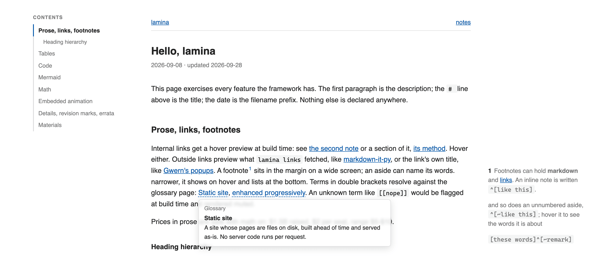

<h1 align="center">Lamina</h1>

<div align="center">

### A just enough HTML page generator for markdown files


**[See it live: lamina-demo.pages.dev](https://lamina-demo.pages.dev/)**

</div>

Think of the best long read you've found online. The notes sat beside the
sentence. Every link showed you where it led before you clicked. You never
lost your place.

Lamina builds that page.



## Why Lamina

- **You only write.** No front matter.
- **Pages stay light.** Plain HTML that reads with JavaScript off.
- **Small enough to own.** About 1k lines of Python, no options, no plugins.

## Who it is for

Minimalists and greybeards who think a website is a folder of HTML files.

Want tags? Use Hugo. Want AI search? Use Mintlify. Want a graph? Use Obsidian Publish.

## Try it

```sh
uv tool install git+https://github.com/wilbeibi/lamina
mkdir -p notes/pages/notes && cd notes
printf 'name = "notes"\n\n[[category]]\ndir = "notes"\n' > site.toml
printf '# Hello\n\nThe title is the first line, the description this paragraph.\n' > pages/notes/2026-09-29-hello.md
lamina serve
```

The rest is in [SKILL.md](SKILL.md): the reference for you, a skill for your agent.
