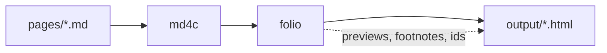

# Hello, folio

This page exercises every feature the framework has. The first paragraph is the description; the `# ` line above is the title; the date is the filename prefix. Nothing else is declared anywhere.

## Prose, links, footnotes

Internal links get a hover preview at build time: see [the second note](second-note.html) or a section of it, [its method](second-note.html#Method). Hover either. A footnote[^why] shows on hover too and still lists at the bottom. Terms in double brackets resolve against the glossary page: [[Static site]], [[Progressive enhancement|enhanced progressively]]. An unknown term like [[nope]] is flagged at build time and rendered muted.

Prices in prose are safe with math on: $1.5B raised, $2 per seat, range $5-$10.

[^why]: Footnotes are GFM syntax; md4c lacks them, so `folio` handles them itself. They can hold **markdown** and [links](second-note.html).

### Heading hierarchy

Third-level headings appear indented in the contents minimap without crowding it with deeper headings.

## Tables

GFM pipe tables work now (they didn't under smu). Headers sort on click, numbers compare as numbers.

| project | stars | growth | note |
|---|---|---|---|
| alpha | 12.4K | 8% | steady |
| beta | 980 | 31% | new |
| gamma | 1.2M | -2% | plateau |

Raw HTML tables wrapped in `<div class="t">` still work exactly as before.

## Code

```python
def hello(name: str) -> str:
    return f"hello, {name}"
```

    indented code still works too

## Mermaid



Rendered client-side by mermaid, theme follows the OS setting, source text is the no-JS fallback.

## Math

Inline: the loss is $\mathcal{L} = -\sum_i y_i \log \hat{y}_i$ and the update is $\theta \leftarrow \theta - \eta \nabla_\theta \mathcal{L}$.

$$
\begin{aligned}
\operatorname{softmax}(z)_i &= \frac{e^{z_i}}{\sum_j e^{z_j}} \\
\mathrm{KL}(p \,\|\, q) &= \sum_x p(x) \log \frac{p(x)}{q(x)}
\end{aligned}
$$

MathJax loads only on pages that contain math.

## Embedded animation

A raw HTML block with its own script. Page assets live in a directory named like the page (`2026-09-08-hello-folio/`) and are served under `/hello-folio/`. The script uses `folio.onVisible` to start only when scrolled into view, `folio.reducedMotion` to respect the OS setting, and `folio.dark()` for colours.

<div class="viz">
<canvas id="wave" width="640" height="160" aria-label="animated sine waves"></canvas>
<script defer src="/hello-folio/anim.js"></script>
</div>

Inline `<script>` works the same way; a file is just easier to edit.

## Details, revision marks, errata

> [!NOTE] A quiet aside
> Callouts use ordinary blockquote syntax and remain readable as source.

> [!IMPORTANT] Keep this invariant
> Use this for the conclusion or constraint a reader must retain.

> [!WARNING] Check before rollout
> Reserve warnings for a real risk or failure mode.

## Materials

- [Animation source](hello-folio/anim.js)
- [Example raw results](hello-folio/results.json)

<details>
<summary>Folded section (markdown inside works now)</summary>

Content with **bold** and a list:

- one
- two

</details>

<ins datetime="2026-09-08" data-d="09-08">This paragraph was revised; the margin badge says when.</ins>

Struck text: ~~old claim~~ with GFM strikethrough, or `<del>` as before.

<div class="errata">
<p><strong>Errata</strong></p>
<ul>
<li>09-08 — nothing yet; this block shows the styling.</li>
</ul>
</div>
