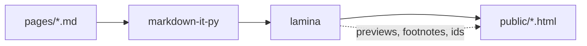

# Hello, lamina

This page exercises every feature the framework has. The first paragraph is the description; the `# ` line above is the title; the date is the filename prefix. Nothing else is declared anywhere.

## Prose, links, footnotes

Internal links get a hover preview at build time: see [the second note](second-note.html) or a section of it, [its method](second-note.html#Method). Hover either. Outside links preview what `lamina links` fetched, like [markdown-it-py](https://github.com/executablebooks/markdown-it-py), or the link's own title, like [Gwern's popups](https://gwern.net/design "Where hover previews for links grew up: annotations for every outside link."). A footnote[^why] sits in the margin on a wide screen^[~and so does an unnumbered aside, `^[~like this]`; hover it to see the words it is about]; [an aside can name its words]^[~`[these words]^[~remark]`]. narrower, it shows on hover and lists at the bottom. Terms in double brackets resolve against the glossary page: [[Static site]], [[Progressive enhancement|enhanced progressively]]. An unknown term like `[[nope]]` would be flagged at build time and rendered muted.

Prices in prose are safe with math on: $1.5B raised, $2 per seat, range $5-$10.
Code beside a price stays literal: $1.5B raised; write `$x$` to show the syntax.

[^why]: Footnotes can hold **markdown**, [links](second-note.html), and math such as $x^2$. An inline note is written `^[like this]`.

### Heading hierarchy

Third-level headings appear indented in the contents minimap without crowding it with deeper headings.
Use the `#` beside a heading to link directly to that section.

## Tables

GFM pipe tables. Headers sort ascending on the first click, descending on the next. Complete numbers compare numerically.

| project | stars | growth | note |
|---|---|---|---|
| alpha | **12.4K**[^stars] | 8% | steady |
| beta | 980 | 31% | new |
| gamma | 1.2M | -2% | plateau |

[^stars]: Counts are rounded; annotations do not affect sorting.

Raw HTML tables wrapped in `<div class="t">` still work exactly as before.

| value | meaning |
|---|---|
| 2026 roadmap | text label |
| $1,200 | currency |
| 8% | percentage |
| 12.4K | abbreviated number |
| 2026-10-01 | date, sorted as text |
| -2 | signed number |
| $-2 | negative currency |
| -$3 | negative currency, sign first |
| 12,34 | malformed grouping, sorted as text |

| concept | equation |
|---|---|
| [[Static site\|Static output]] | $x^2$ |
| **Square root** | $\sqrt{x}$ |

## Code

The Copy button copies the code exactly, including indentation and newlines.

```python
def hello(name: str) -> str:
    return f"hello, {name}"
```

    indented code still works too

## Mermaid



Rendered client-side by mermaid, theme follows the OS setting, source text is the no-JS fallback.

## Math

Inline: the loss is $\mathcal{L} = -\sum_i y_i \log \hat{y}_i$ and the update is $\theta \leftarrow \theta - \eta \nabla_\theta \mathcal{L}$.

$$
\begin{aligned}
\operatorname{softmax}(z)_i &= \frac{e^{z_i}}{\sum_j e^{z_j}} \\
\mathrm{KL}(p \,\|\, q) &= \sum_x p(x) \log \frac{p(x)}{q(x)}
\end{aligned}
$$

Temml renders native MathML and loads only on pages that contain math. Without JavaScript, the TeX source stays visible.

$$\gdef\RR{\mathbb{R}}$$

Global macros work in the page and its footnote previews: $x \in \RR$.[^domain]

[^domain]: The domain is $\RR$.

## Images

Click the image to enlarge it, or focus it and press Enter. Choose Full size to inspect details. Close it with Escape, the Close button, or the backdrop.


Local images and audio/video sources are checked at build time, along with video posters.

## Embedded animation

A raw HTML block with its own script. Page assets live in a directory named like the page (`2026-09-08-index/`) and are served under `/index/`. The script uses `lamina.onVisible` to start only when scrolled into view, `lamina.reducedMotion` to respect the OS setting, and `lamina.dark()` for colours.

<div class="viz">
<canvas id="wave" width="640" height="160" aria-label="animated sine waves"></canvas>
<script defer src="/index/anim.js"></script>
</div>

Inline `<script>` works the same way; a file is just easier to edit.

## Details, revision marks, errata

> [!NOTE] A quiet aside
> Callouts combine **formatting**, [[Static site|links]], and math: $a^2 + b^2 = c^2$.
>
> - Inline code stays literal: `$x$`.
> - Math works in a list: $\sqrt{x}$.

> [!ASIDE] An aside is a margin remark, one line or several.

> [!IMPORTANT] Keep this invariant
> Use this for the conclusion or constraint a reader must retain.

> [!WARNING] Check before rollout
> Reserve warnings for a real risk or failure mode.

## Materials

- [Animation source](index/anim.js)
- [Example raw results](index/results.json)

<details>
<summary>Folded section (markdown inside works now)</summary>

Content with **bold** and a list:

- one
- two

</details>

<details>
<summary>Repeated headings keep distinct links</summary>

#### Same

The first heading uses `Same`.

#### Same

The repeated heading uses `Same-2`.

#### Same-2

This heading uses `Same-2-2`, avoiding the earlier generated name.

</details>

<ins datetime="2026-09-08" data-d="09-08">This paragraph was revised; the margin badge says when.</ins>

Struck text: ~~old claim~~ with GFM strikethrough, or `<del>` as before.

<div class="errata">
<p><strong>Errata</strong></p>
<ul>
<li>09-08 — nothing yet; this block shows the styling.</li>
</ul>
</div>
